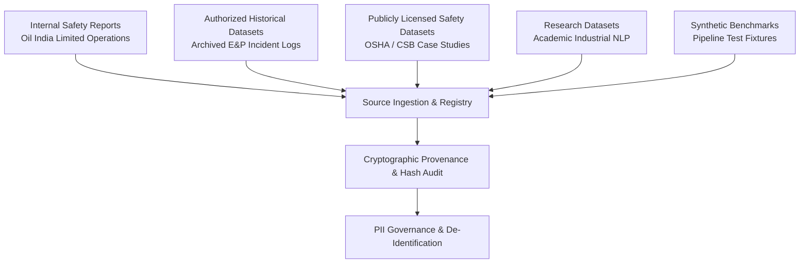

# SIFT Real Data Acquisition & Provenance Specification

**Specification Version:** `1.0.0`  
**Effective Date:** `2026-08-30`  
**Applicability:** All incoming safety observation narratives, incident records, near-miss reports, and hazard logs ingested into SIFT.

---

## 1. Data Classification Hierarchy

To preserve legal integrity, prevent data contamination, and enforce privacy boundaries, all acquired data sources are classified into four mutually exclusive categories:

| Classification | Definition | Allowed Use | Example Sources |
| :--- | :--- | :--- | :--- |
| **`REAL`** | Authentic frontline safety reports authored by operational personnel in industrial facilities. | Model training, validation, production benchmarking, and safety surveillance. | Oil India Limited HSE incident reports, drilling near-miss logs, permit audits. |
| **`PUBLIC`** | Publicly accessible datasets published under open licenses (CC-BY, MIT, ODC-By). | Exploration, baseline benchmarking, and transfer learning research. | OSHA incident archives, NIOSH research corpora, CSB investigation texts. |
| **`SYNTHETIC`** | Expert-crafted or algorithmically generated scenarios designed to test edge cases. | Unit tests, CI/CD pipeline verification, integration tests, schema fuzzing. | `data/fixtures/sample_raw_reports.jsonl` |
| **`DEMO`** | Seeded demonstration records specifically provided for initial IDE and UX preview. | Frontend/API development and pipeline dry-runs (**NEVER used as ML ground truth**). | Database seed fixtures. |

---

## 2. Supported Data Source Types



### Source Type 1: Internal Safety Reports (`INTERNAL_SAFETY_REPORTS`)
- Direct extracts from Oil India Limited (OIL) HSE event management databases, Near Miss reporting cards, and hazard hunt campaigns across Assam/Arunachal operational areas.
- **Permission Requirement:** Explicit authorization from OIL HSE Directorate.
- **Privacy Standard:** Redaction of employee names, phone numbers, and badge IDs prior to human annotation.

### Source Type 2: Authorized Historical Datasets (`AUTHORIZED_HISTORICAL_DATASET`)
- Retrospective incident and near-miss logs from past operational drilling and production campaigns.
- **Lineage Requirement:** Fixed temporal timestamps and asset identifier tracking.

### Source Type 3: Publicly Licensed Safety Datasets (`PUBLIC_LICENSED_SAFETY_DATASET`)
- Open-access incident corpora from regulatory and safety boards (e.g. US Chemical Safety Board, OSHA enforcement summaries).
- **License Requirement:** Explicit CC-BY, Public Domain, or Open Government License attribution.

### Source Type 4: Research Datasets (`RESEARCH_DATASET`)
- Curated academic industrial safety corpora.

### Source Type 5: Synthetic Benchmarks (`SYNTHETIC_BENCHMARK`)
- Synthetic test fixtures designed for automated regression testing.

---

## 3. Source Registration & Provenance Schema

Every acquired dataset source must be registered in [`data/metadata/source_registry.json`](file:///Users/satyamkumar/Desktop/SIFT/data/metadata/source_registry.json) using `scripts/register_source.py`:

```json
{
  "source_id": "SRC-OIL-2026-01",
  "source_name": "OIL Upper Assam Operations Q1-Q2 2026",
  "source_type": "INTERNAL_SAFETY_REPORTS",
  "classification": "REAL",
  "license": "PROPRIETARY_OIL_INTERNAL",
  "permission_status": "AUTHORIZED",
  "collection_date": "2026-06-30",
  "data_owner": "Oil India Limited HSE Directorate",
  "allowed_use": "SIFT Model Training & Safety Intelligence",
  "pii_status": "SCANNED_AND_REDACTED",
  "record_count": 1250,
  "raw_file_sha256": "3a7b9c...",
  "ingested_at": "2026-08-30T12:00:00Z",
  "status": "ACTIVE"
}
```

### Granular Record-Level Provenance:
Every individual record carries provenance lineage throughout the lifecycle:
- `source_id`: Points to the registered source entry.
- `source_record_id`: Unique primary key from the original source system.
- `source_file`: Original raw file filename.
- `ingestion_timestamp`: UTC ISO-8601 ingestion time.

---

## 4. Immutable Raw Data Isolation

```
data/raw/           (Strictly Immutable, Read-Only, Excluded from Git)
  ↓
data/interim/       (Normalized, PII-Scanned, De-Identified Working Layer)
  ↓
data/annotations/   (Double-Blind Tasks & Annotator Submissions)
  ↓
data/validated/     (Consensus / Adjudicated Authoritative Ground Truth)
  ↓
data/splits/        (Temporal, Event-Isolated Train/Val/Test Partitions)
```

1. Files written to `data/raw/` are **cryptographically hashed (SHA-256) upon arrival and never modified**.
2. All normalization, PII redaction, and cleaning occur in `data/interim/`.
3. Annotators only interact with tasks derived from `data/interim/`.
