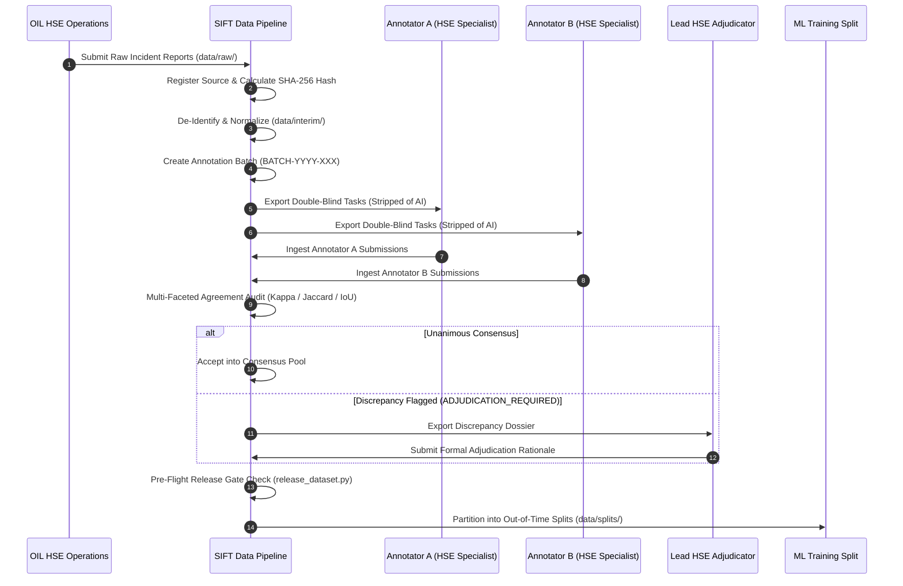

# SIFT Real Data Annotation & Release Workflow

A step-by-step operational guide for ingesting authentic frontline safety reports, managing double-blind specialist annotation, auditing agreement, resolving discrepancies via expert adjudication, and releasing verified ground-truth datasets.

---

## 1. End-to-End Operational Lifecycle



---

## 2. Step-by-Step Command Guide

### Step 1: Register Source & Ingest
```bash
python scripts/register_source.py register \
    --source-id SRC-OIL-2026-01 \
    --name "OIL Upper Assam Field Data Q1-Q2 2026" \
    --type INTERNAL_SAFETY_REPORTS \
    --classification REAL \
    --permission AUTHORIZED \
    --raw-file data/raw/oil_q1_q2_2026_reports.jsonl \
    --owner "Oil India Limited HSE Directorate"
```

### Step 2: Create and Export Annotation Batch
```bash
python scripts/manage_annotations.py create-batch \
    --batch-id BATCH-2026-001 \
    --source-id SRC-OIL-2026-01 \
    --input data/interim/oil_q1_q2_2026_normalized.jsonl \
    --output-tasks data/annotations/batch_2026_001_tasks.jsonl \
    --annotators "HSE-ANN-01,HSE-ANN-02"
```

### Step 3: Audit Inter-Annotator Agreement
```bash
python scripts/manage_annotations.py audit \
    --annotator-a data/annotations/batch_001_sub_a.jsonl \
    --annotator-b data/annotations/batch_001_sub_b.jsonl \
    --output-consensus data/validated/batch_001_consensus.jsonl \
    --output-disagreements data/annotations/batch_001_disagreements.json \
    --batch-id BATCH-2026-001
```

### Step 4: Apply Lead Expert Adjudication
When discrepancies occur (`ADJUDICATION_REQUIRED`), the Lead HSE Specialist reviews both submissions and supplies binding decisions:
```bash
python scripts/manage_annotations.py adjudicate \
    --base-reports data/interim/oil_q1_q2_2026_normalized.jsonl \
    --adjudications data/annotations/batch_001_lead_adjudications.jsonl \
    --output data/validated/batch_001_adjudicated.jsonl
```

### Step 5: Execute Release Gate & Dataset Release
Combines consensus records and adjudicated records into an official versioned dataset release:
```bash
python scripts/release_dataset.py \
    --source-records data/validated/all_verified_records.jsonl \
    --dataset-id sift_dataset \
    --version 1.0.0
```

---

## 3. Ground-Truth Release Gate Checklist

Before `release_dataset.py` allows an official dataset release, all 7 gates must pass:

- [x] **Source Registration & Authorization:** Verified in `data/metadata/source_registry.json`.
- [x] **Zero Unredacted PII:** Clean scan across phone numbers, emails, employee IDs, and IP addresses.
- [x] **100% Annotation Completeness:** All records in `CONSENSUS_ACCEPTED` or `ADJUDICATED` state.
- [x] **Taxonomy Conformance:** All labels adhere to canonical `1.0` taxonomy enums.
- [x] **Evidence Span Character Invariant:** `raw_text[start:end] == span.text` holds without exception.
- [x] **Zero Cross-Split Contamination:** Event grouping and near-duplicate cluster isolation verified.
- [x] **High-SIF Safety Floor:** Test split contains required representation of High-SIF observations.
