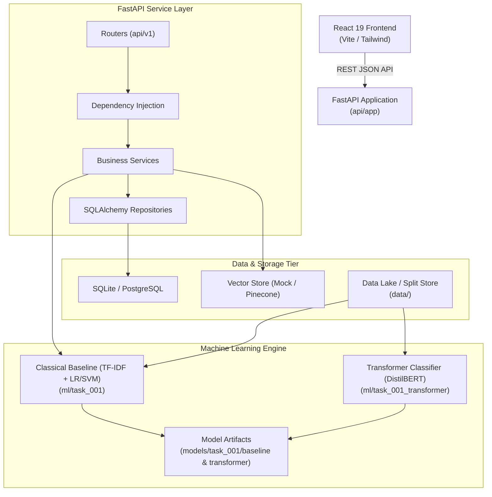

# SIFT Platform Architecture

**Safety Intelligence & Fatality-risk Tracking Platform**  
High-level architectural blueprint, subsystem boundaries, data contracts, and integration models.

---

## 1. System Topology

---

## 2. Core Subsystems

| Subsystem | Primary Path | Responsibility |
| :--- | :--- | :--- |
| **API** | `api/app/` | Async REST endpoints, Pydantic request/response schemas, service orchestration, database models & repositories. |
| **Frontend** | `src/` | Interactive dashboard, human review triage queue, AI classification insights, action items management, and facility statistics. |
| **Data Pipeline** | `data_pipeline/` | Frontend report ingestion, governance/PII sanitization, deduplication, double-blind annotation batch management, and stratified dataset splitting. |
| **ML Models** | `ml/` | TASK-001 SIF potential classification models: classical linear baseline and fine-tuned contextual transformer. |
| **Model Registry** | `models/` | Serialized model weights: `baseline/` for `.joblib` pipelines and `transformer/` for Hugging Face checkpoints. |
| **Test Suite** | `tests/` & `api/tests/` | Comprehensive test coverage across data pipelines, ML determinism/inference, and FastAPI async endpoints. |
| **Configuration** | `configs/` | Centralized, declarative configuration templates for models and runtime environments. |

---

## 3. Related Architecture Specifications

- [Master AI & Data Specification](SIFT_AI_DATA_SPEC.md)
- [Canonical Safety Taxonomies](../ai/datasets/TAXONOMY.md)
- [Model Specification Roadmap](../ai/models/MODEL_SPECIFICATION.md)
- [Runtime Inference Contract](../ai/models/INFERENCE_CONTRACT.md)
- [Evaluation Protocol](../experiments/EVALUATION_PROTOCOL.md)
